# OpenLDAP Server

O **LDAP** ou **Lightweight Directory Access Protocol** (protocolo leve de acesso a diretórios) permite que qualquer usuário localize e se conecte ao pessoas e recursos disponibilizados em um diretório corporativo, como arquivos e dispositivos em uma rede pública ou privada. O LDAP segue o padrão X.500, um padrão para serviços de diretório em uma rede que normalmente usa o modelo cliente/servidor.

O LDAP é leve porque em sua versão inicial não incluía recursos de segurança. O principal uso dos serviços de diretório é armazenar informações de usuários e dados de objetos em um banco de dados central e disponibilizar esses dados para outras aplicações, principalmente para autenticação ou como um catálogo de endereços, e podemos fazer isso usando um servidor OpenLDAP.

Este documento aborda a configuração do servidor OpenLDAP e a autenticação de uma estação cliente Windows 7 usando o protocolo LDAP no Ubuntu 16.04, mas pode ser facilmente convertido para versões superiores ou outras distribuições, com seus devidos ajustes, apesar de cada distribuição Linux ter suas peculiaridades.

## O que um servidor LDAP faz

- Mantém informações de usuários e objetos de rede em um banco de dados central disponível para consulta
- Armazena informações como: texto sem formatação, imagens, dados binários e certificados de chave pública
- Fornece serviços de autenticação e autorização, como gerenciamento de login e senhas para usuários de rede
- Também pode armazenar registros DNS em seu banco de dados
- Pode ser usado como catálogo de endereços e pessoas para empresas de qualquer tamanho

## Terminologia

A terminologia utilizada em um serviço de diretório faz parte da especificação X.500, que define atributos em um diretório LDAP. Abaixo seguem alguns dos atributos mais comuns:

Atributo X.500   |   Terminologia
-----------------|-------------------------
CN               |   commonName
L                |   localityName
ST               |   stateOrProvinceName
O                |   organizationName
OU               |   organizationalUnitName
C                |   countryName
STREET           |   streetAddress
DC               |   domainComponent
UID              |   userid
DN               |   Distinguished name

O último atributo (DN) é composto por uma série de outros atributos separados por vírgula, usados para identificar entradas exclusivas na hierarquia de diretórios. O DN é o nome completo da entrada.

A string ```CN=administrators,OU=Grupos,DC=meudominio,DC=com``` representa um caminho único dentro da estrutura hierárquica do diretório chamada de Directory Information Tree (DIT), e deve ser lida da direita (raiz) para esquerda (folha).

## Definições da instalação

O servidor OpenLDAP será instalado numa máquina virtual rodando o Ubuntu Server 16.04 sobre o software de virtualização Virtualbox. Também será configurada uma máquina virtual cliente rodando o Windows 7 que recuperará credenciais de login diretamente do servidor OpenLDAP para autenticar os usuários.

Dependendo de quais grupos LDAP um usuário fizer parte, o mesmo será mapeado automaticamente ao grupo correspondente dentro do Windows 7.

Função            | Endereço IP | Hostname              | Sistema Operacional
------------------|-------------|-----------------------|---------------------
Servidor OpenLDAP | 10.10.10.10 | ldap.meudominio.com   | Ubuntu Server 16.04
Estação cliente   | 10.10.10.20 | win7.meudominio.com   | Windows 7 SP1

O domínio LDAP que será utilizado será o **meudominio.com**, assim como o sufixo DNS do servidor e estação cliente.

Toda a instalação será executada com privilégios elevados (sudo) de forma a reduzir as interações do administrador durante a configuração:

```bash
$ sudo su
[sudo] password for user: 
# 
```

O Ubuntu 16.04 vem com o firewall UFW habilitado por padrão. Para fins de facilidade da implantação, a comunicação nas portas referentes aos serviços LDAP, LDAPS e SSH (respectivamente) serão abertas para viabilizar a comunicação de estações clientes ao servidor OpenLDAP:

```bash
# ufw allow 389/tcp
# ufw allow 686/tcp
# ufw allow 22/tcp
# ufw reload
```

## Instalação do servidor OpenLDAP Server

Atualize o sistema e instale o OpenLDAP e seus utilitários usando o ```apt```. Em seguida, habilite o serviço através do ```systemctl```para ser carregado durante a inicialização do sistema:

```bash
# apt update && apt -y upgrade
# apt -y install slapd ldap-utils
# systemctl enable slapd
```

Com o OpenLDAP instalado, vamos alterar os padrões fornecidos com o Ubuntu para se adequar à nossa necessidade. Execute o comando ```dpkg-reconfigure slapd``` para abrir a ferramenta de configuração do OpenLDAP.

A ferramenta de configuração fará uma série de perguntas para reconfigurar o OpenLDAP:

1. 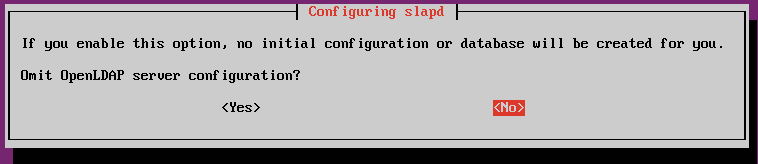

    Como o OpenLDAP já foi instalado com o esquema base, omita a configuração selecionando **No**.

2. 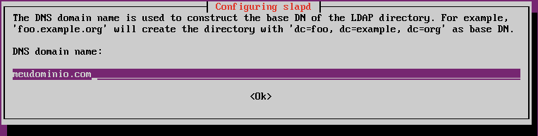

    Confirme o nome DNS do seu domínio. Esta estrutura será utilizada para criar a árvore de diretório do seu servidor OpenLDAP.

3. 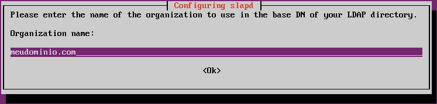

    O nome da organização é comumente o mesmo nome DNS do seu domínio. Basta confirmar e seguir com a reconfiguração.

4. 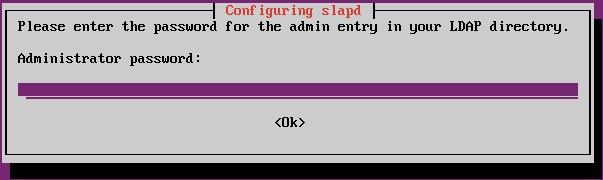

    Insira a senha do usuário admin do seu diretório OpenLDAP.

5. 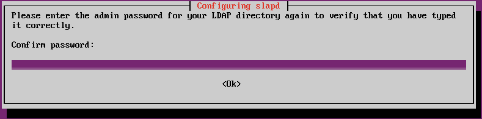

    Na sequência, será solicitada a confirmação da senha digitada na etapa anterior, basta repeti-la e seguir com a reconfiguração.

6. 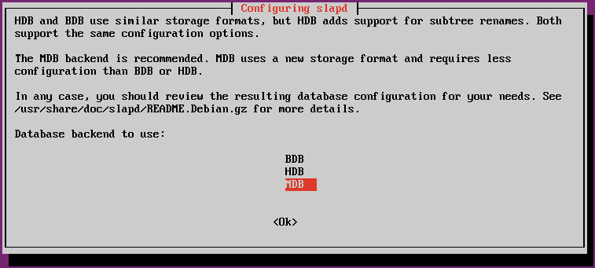

    Selecione o formato do banco de dados para armazenamento da árvore de diretório do seu servidor OpenLDAP. Aqui selecionamos o formato MDB, por ser mais atual e requerer menos configurações.

7. 

    Selecione se deseja manter ou excluir a base de dados no caso de remoção do OpenLDAP do servidor. Nós decidimos por manter a base de dados selecionando **No**.

8. 

    Caso hajam arquivos no diretório ```/var/lib/ldap```, os mesmos podem ser removidos durante a reconfiguração selecionando **Yes**.

9. 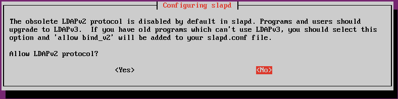

    O protocolo LDAPv2 é antigo e vem desabilitado por padrão em novas instalações do OpenLDAP. Como estamos implantando um ambiente do zero, decidimos não implantar esta versão em nossa configuração selecionando **No**.

Após concluir a reconfiguração do slapd, reinicie o serviço do OpenLDAP:

```bash
# systemctl restart slapd
```

Neste ponto, concluímos a instalação e configuração básica do servidor OpenLDAP, de forma que ele representasse a estrutura de diretório para o domínio **meudominio.com**.

Para encontrar a entrada para o usuário **admin** no diretório OpenLDAP, usaremos o comando ```ldapsearch```. O ```ldapsearch``` solicitará a senha de administrador que fornecemos durante a reconfiguração do OpenLDAP:

```bash
# ldapsearch -x -W -D cn=admin,dc=meudominio,dc=com -b dc=meudominio,dc=com -LLL
Enter LDAP Password: 
dn: dc=meudominio,dc=com
objectClass: top
objectClass: dcObject
objectClass: organization
o: meudominio.com
dc: meudominio

dn: cn=admin,dc=meudominio,dc=com
objectClass: simpleSecurityObject
objectClass: organizationalRole
cn: admin
description: LDAP administrator
userPassword:: e1NTSEF9VVM2dis0dTR5L3h5OTM0RWJMNUFOT1VlaWEzNUwza3g=
```

## Unidades Organizacionais (OU)

Unidades organizacionais são estruturas em um serviço de diretório utilizadas para organizar usuários e objetos de um serviço de diretório. É recomendado criar Unidades Organizacionais para cada tipo de objeto que deve ser gerenciado pelo serviço de diretório.

### Adicionando Unidades Organizacionais

Para adicionar uma OU, criaremos um arquivo LDIF (LDAP Data Interchange Format), que é o formato de texto padrão projetado para inserir e remover informações do servidor LDAP. Aqui adicionaremos três unidades organizacionais, **Grupos**, **Usuarios** e **Teste** (a OU teste será excluída posteriormente, na próxima sessão).

```bash
# vim ou_Grupos_Usuarios.ldif

dn: ou=Grupos,dc=meudominio,dc=com
changetype: add
objectClass: organizationalUnit
objectClass: top
ou: Grupos

dn: ou=Usuarios,dc=meudominio,dc=com
changetype: add
objectClass: organizationalUnit
objectClass: top
ou: Usuarios

dn: ou=Teste,dc=meudominio,dc=com
changetype: add
objectClass: organizationalUnit
objectClass: top
ou: Teste
```

Usaremos o comando ```ldapadd``` para adicionar a unidade organizacional acima:

```bash
# ldapadd -W -D "cn=admin,dc=meudominio,dc=com" -f ou_Grupos_Usuarios.ldif
```

### Excluindo uma unidade organizacional (OU)

Para excluir uma unidade organizacional, use o comando ```ldapdelete``` especificando o DN da OU. Abaixo vamos excluir a OU recém-criada **Teste**:

```bash
# ldapdelete -W -D "cn=admin,dc=meudominio,dc=com" "ou=Teste,dc=meudominio,dc=com"
Enter LDAP Password:
```

## Grupos

Grupos são estruturas organizacionais que permitem a inclusão de membros de um diretório LDAP. São comumente utilizados para granularizar o acesso a recursos de rede.

### Adicionando grupos

Para adicionar um grupo posix, criaremos um arquivo LDIF para ele:

```bash
# vi group_users_administrators.ldif
dn: cn=teste,ou=Grupos,dc=meudominio,dc=com
objectClass: posixGroup
objectClass: top
cn: teste
gidNumber: 501

dn: cn=administrators,ou=Grupos,dc=meudominio,dc=com
objectClass: posixGroup
objectClass: top
cn: administrators
gidNumber: 502

dn: cn=users,ou=Grupos,dc=meudominio,dc=com
objectClass: posixGroup
objectClass: top
cn: users
gidNumber: 503
```

Use o comando ```ldapadd``` como antes para adicionar o grupo ao diretório:

```bash
# ldapadd -x -W -D "cn=admin,dc=meudominio,dc=com" -f group_users_administrators.ldif
Enter LDAP Password:
adding new entry "cn=teste,ou=Grupos,dc=meudominio,dc=com"
adding new entry "cn=administrators,ou=Grupos,dc=meudominio,dc=com"
adding new entry "cn=users,ou=Grupos,dc=meudominio,dc=com"
```

### Deletando grupos

Para excluir um grupo, use ```ldapdelete``` especificando o DN do grupo.

```bash
# ldapdelete -W -D "cn=admin,dc=meudominio,dc=com" "cn=teste,ou=groups,dc=meudominio,dc=com"
Enter LDAP Password:
```

## Usuários

Assim como grupos, usuários são estruturas organizacionais dentro de um diretório LDAP. Usuários são comumente utilizados para dar permissões de acesso à recursos em uma rede corporativa, e podem ser inclusos como membros de um grupo.

### Adicionando usuários

Antes de criar os usuários, crie o hash SSHA das senhas que serão atribuídaos aos usuários utilizando o comando ```slappasswd```:

```bash
# slappasswd -h {SSHA} -s P@ssw0rd
{SSHA}rGbIaTDAwVjkiRpSrWarV2VzU0uPPY0J
```

Next create a ldif file for a user

```bash
# vim create_users.ldif
dn: uid=teste,ou=Usuarios,dc=meudominio,dc=com
objectClass: inetOrgPerson
objectClass: posixAccount
objectClass: shadowAccount
uid: teste
sn: Teste
givenName: Teste
cn: teste
uidNumber: 1000
gidNumber: 501
userPassword: {SSHA}rGbIaTDAwVjkiRpSrWarV2VzU0uPPY0J
loginShell: /bin/sh
homeDirectory: /home/teste
```

Certifique-se de fornecer o **Group ID Number** correto (gidNumber). Adicione o usuário acima usando o comando ```ldapadd```:

```bash
# ldapadd -x -W -D "cn=admin,dc=meudominio,dc=com" -f create_users.ldif
Enter LDAP Password:
adding new entry "uid=teste,ou=Usuarios,dc=meudominio,dc=com"
```

### Deletando usuários

Para excluir um usuário, use o comando ```ldapdelete```:

```bash
# ldapdelete -W -D "cn=admin,dc=meudominio,dc=com" "uid=teste,ou=groups,dc=meudominio,dc=com"
```

Verifique se a entrada foi excluída usando o seguinte comando:

```bash
# ldapsearch -x -b "dc=meudominio,dc=com"
```

## Realizando buscas numa base de dados OpenLDAP

A partir do servidor OpenLDAP é possível verificar se você consegue ler informações do banco de dados. O comando a seguir realiza um dump de todo o conteúdo do diretório:

```bash
# ldapsearch -x -LLL -H ldap:/// -b dc=meudominio,dc=com
dn: dc=meudominio,dc=com
objectClass: top
objectClass: dcObject
objectClass: organization
o: meudominio.com
dc: meudominio

dn: cn=admin,dc=meudominio,dc=com
objectClass: simpleSecurityObject
objectClass: organizationalRole
cn: admin
description: LDAP administrator

dn: ou=Grupos,dc=meudominio,dc=com
objectClass: organizationalUnit
objectClass: top
ou: Grupos

dn: ou=Usuarios,dc=meudominio,dc=com
objectClass: organizationalUnit
objectClass: top
ou: Usuarios

dn: cn=users,ou=Grupos,dc=meudominio,dc=com
gidNumber: 503
cn: users
objectClass: posixGroup
objectClass: top
memberUid: tlarisse
memberUid: gbraga

dn: cn=administrators,ou=Grupos,dc=meudominio,dc=com
gidNumber: 502
cn: administrators
objectClass: posixGroup
objectClass: top
memberUid: tmagalhaes
```

## Usando o phpLDAPadmin

Ao longo desta instalação, criamos, deletamos e pesquisamos OU's, grupos e usuários através da linha de comando. Porém é possível fazer o mesmo através de uma interface web, utilizando a aplicação phpLDAPadmin, que pode ser facilmente instalado utilizando o ```apt```:

```bash
# apt -y install phpldapadmin
```

O ```apt``` já instala todas as dependências da aplicação, como o servidor servidor web Apache e o suporte à linguagem PHP.

Para que seja possível configurar seu diretório LDAP, edite o arquivo de configuração do phpldapadmin para refletir a estrutura de diretórios que criamos anteriormente.

```php
# vim /etc/phpldapadmin/config.php
$servers->setValue('server','name','OpenLDAP MeuDominio.com);
$servers->setValue('server','host','10.10.10.10');
$servers->setValue('server','base',array('dc=meudominio,dc=com'));
$servers->setValue('login','auth_type','session');
$servers->setValue('login','bind_id','cn=admin,dc=meudominio,dc=com');
```

Após realizar esta configuração, basta acessar o phpLDAPadmin através da URL [http://ldap.meudominio.com/phpldapadmin] através de qualquer navegador web dentro da mesma rede.

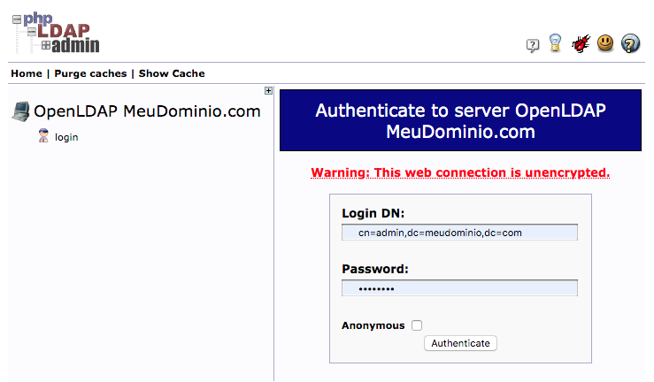

Faça login com o usuário ```cn=admin,dc=meudominio,dc=com``` e a senha definida durante a configuração do OpenLDAP.

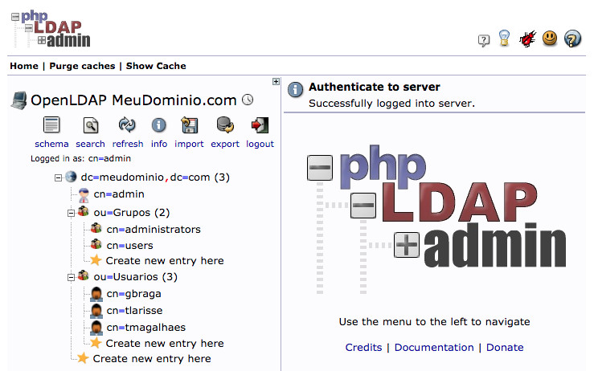

## Autenticação de estações clientes Windows

O Windows tem a possibilidade de usar o OpenLDAP para autenticar logins em estações e servidores. No entanto, para utilizar o recurso, é necessário modificar a DLL de Identificação e Autenticação Gráfica (GINA), que é executada durante o logon interativo do Windows.

A partir do Windows Vista e versões posteriores, o GINA foi substituído pela implementação do provedor de credenciais devido aos recursos de troca rápida de usuário. Uma diferença, no entanto, é que ao GINA poderia substituir completamente a interface de logon do Windows, enquanto provedores de credenciais não podem.

Para contornar isso, há uma implementação Open Source do GINA chamado pGina, compatível com as versões mais atuais, como o Windows Server 2016 e Windows 10.

Abaixo vamos abordar a implementação do pGina em uma estação cliente Windows 7.

### Instalação do pGina

Execute o [instalador do pGina](https://github.com/pgina/pgina/releases/) e siga as instruções dadas na tela.

O pGina requer a instalação do Visual C++ e do .NET Framework 4.0 para funcionar corretamente. Caso não estejam instalados, o instalador lhe dá a opção de baixar durante a instalação.

### Configurar a autenticação local

Após a instalação, inicie o aplicativo de configuração do pGina localizado em ```C:\Program Files\pGina\pGina.Configuration.exe```. Verifique se o **serviço pGina** está em execução e se **Credential Provider/GINA** está instalado e ativado. Esses componentes devem estar habilitados e em execução para que a autenticação funcione corretamente:


Em seguida, na aba Plugin Selection, marque as caixas de seleção da imagem para configurar a autenticação local:

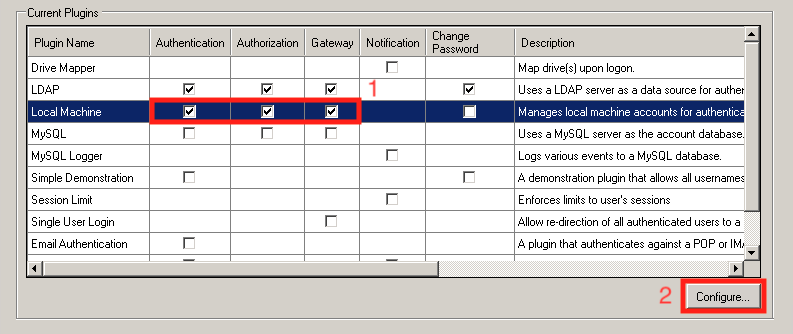

Assegure que as opções sinalizadas estejam marcadas para o correto funcionamento da autenticação local através do pGina.

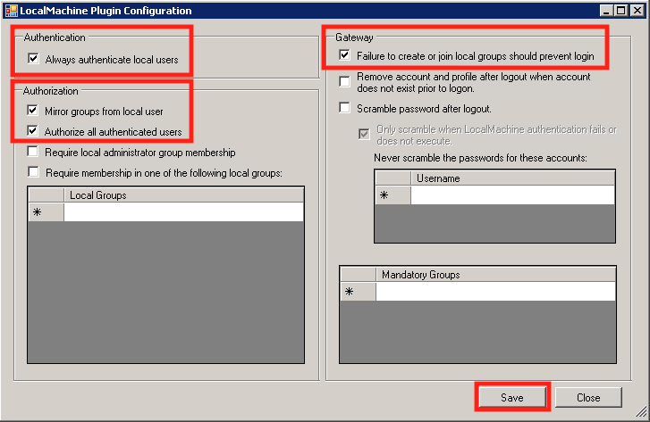

### Configurar a autenticação LDAP

Concluída a configuração da autenticação local, devemos configurar a autenticação com o diretório LDAP. Marque as caixas de seleção da imagem para configurar a autenticação LDAP.

Não deixe de marcar a caixa da coluna **Change Password**, assim será possível o próprio usuário trocar a senha sem necessidade de intervenção de um administrador no servidor OpenLDAP.

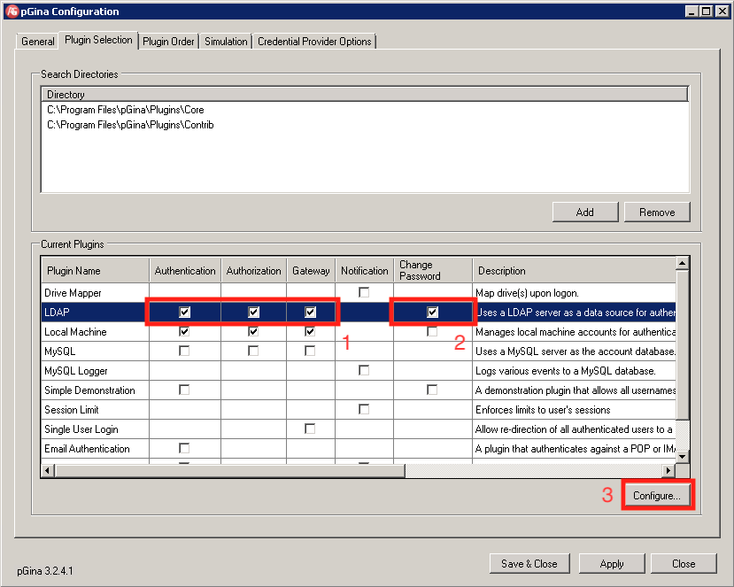

Na guia **General**, configure todas as opções sinalizadas. Na nossa configuração, os dados foram preenchidos da seguinte maneira:

- LDAP Hosts: ```ldap.meudominio.com```
- LDAP Port: ```389```
- Search DN: ```cn=admin,dc=meudominio,dc=com```
- Search Password: ```senha do administrador do OpenLDAP```
- Group DN Pattern: ```cn=%g,ou=Grupos,dc=meudominio,dc=com```

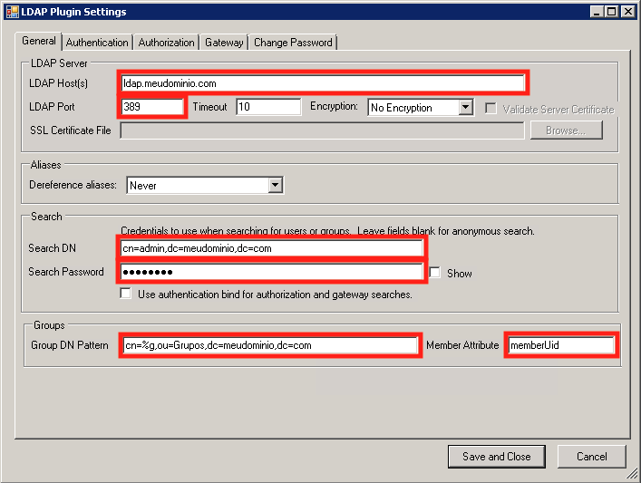

Na guia **Authentication**, desmarque a caixa Allow Empty Passwords e marque a caixa Search for DN.

Configure o Search Filter e Search Context(s) como segue:

- Search Filter: ```cn=%u```
- Search Context(s): ```ou=Usuarios,dc=meudominio,dc=com```

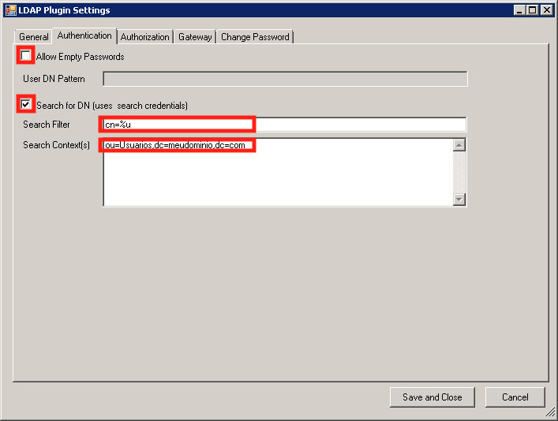

Na guia **Authorization**, habilite as seguintes opções conforme segue:

- [X] Allow
- [ ] Deny
- [X] Deny when LDAP authentication fails
- [ ] Allow when server is unreachable

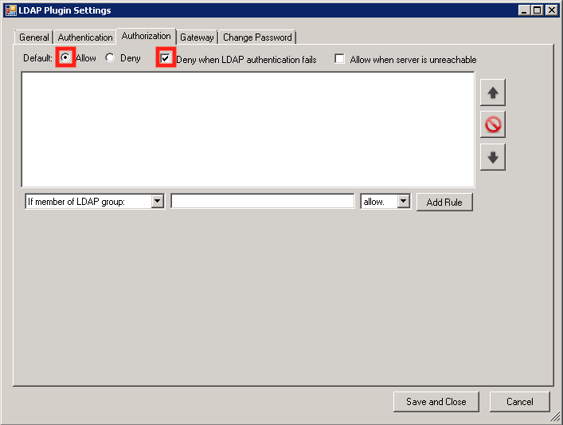

Na guia Gateway, vamos criar duas regras de binding, dessa forma sincronizaremos os usuários que pertençam a um grupo LDAP a um grupo local equivalente no Windows.

Para montarmos este documento, foram criados dois grupos no servidor OpenLDAP com o mesmo nome dos grupos locais do Windows, **administrators** e **users**.

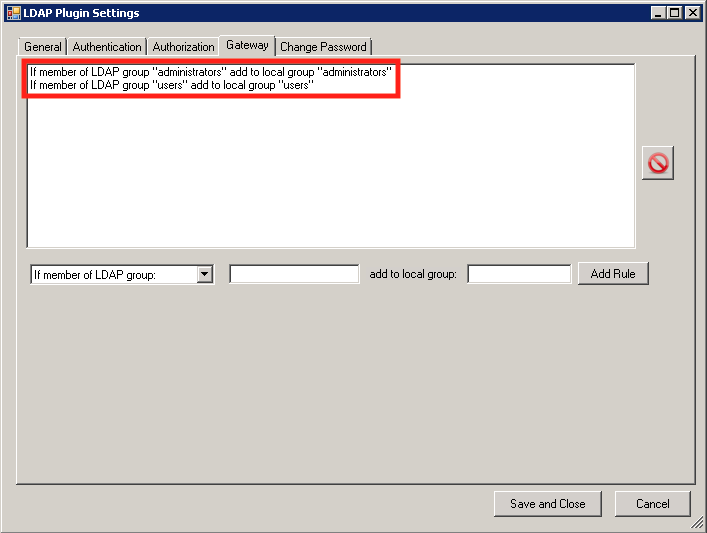

Para encerrarmos a configuração do plugin LDAP, na guia **Change Password**, assegure que a coluna **Hash Method** esteja selecionando **SHA1**.

Clique em **Save and Close** para seguirmos com a configuração do pGina.

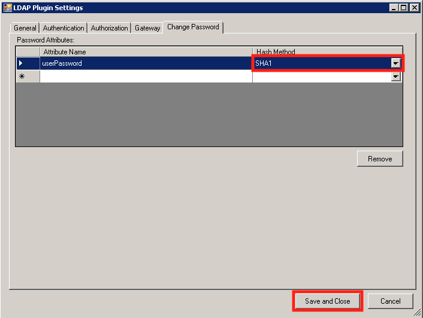

### Ordem dos plugins de autenticação

Como o objetivo é autenticar sistemas em rede, devemos priorizar o plugin LDAP antes da autenticação local do Windows.

Clique nas setas ao lado de cada plugin para colocar o plugin LDAP como primeiro em todas as caixas.

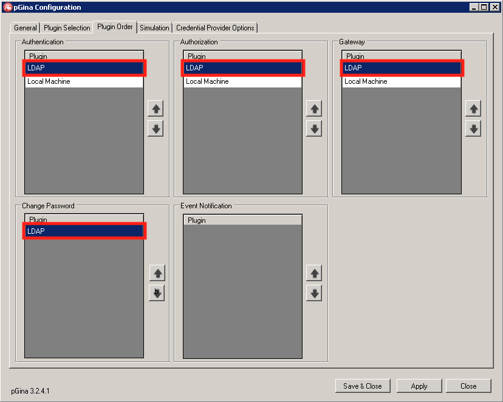

### Verificando a configuração

Vá para a guia **Simulation** e teste a configuração usando suas credenciais(2) do OpenLDAP.

Caso a conexão ocorra com sucesso, você deve obter as 3 verificações verdes (4), como mostrado abaixo. A seção **Local Groups** na parte inferior lista os grupos nos quais o usuário será identificado como membro quando fizer o login. na estação cliente.

Clique em **Save and Close** para encerrar a configuração do pGina.

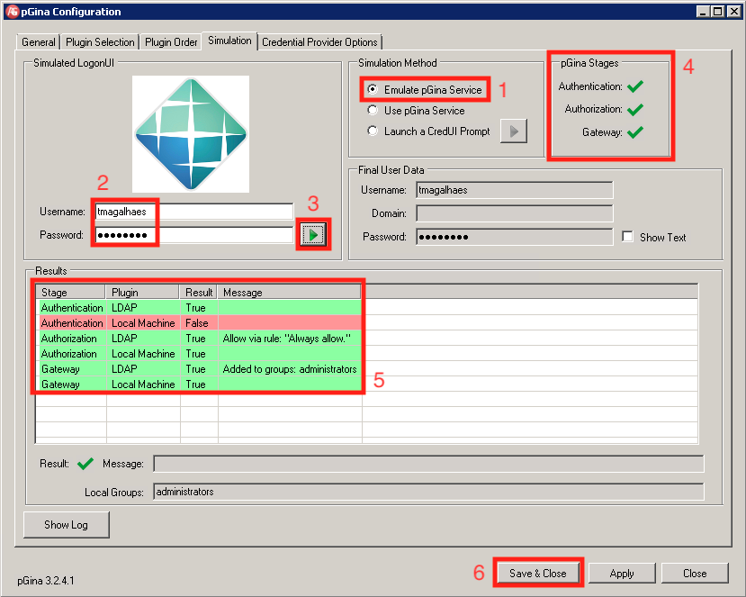

Agora basta selecionar a usar a autenticação **OpenLDAP Login** na tela inicial do Windows e fazer login nas máquinas Windows com seu usuário criado no servidor OpenLDAP.

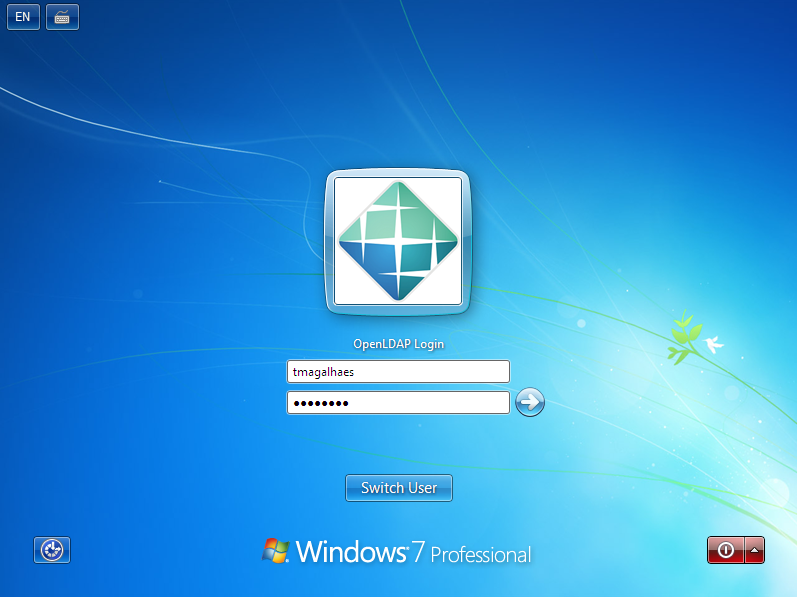

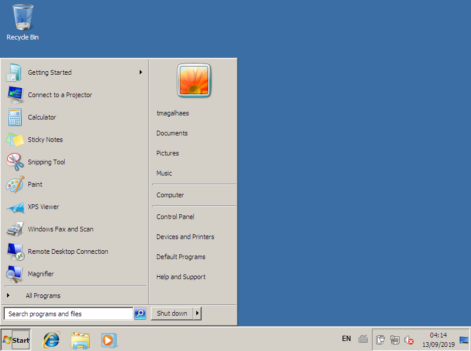

## Conclusão

Usar um servidor OpenLDAP traz vantagens como a centralização das informações de toda a empresa, principalmente no tocante ao gerenciamento usuários e senhas, ao invéz de gerenciar os usuários de cada máquina separadamente.

O OpenLDAP tem uma implantação mais simples que o Active Directory proprietário da Microsoft, e também pode ser usado como uma extensão deste.

Além disso, o OpenLDAP também suporta TLS (Transport Layer Security), para que os dados confidenciais podem ser criptografados durante seu acesso.

## Referências

- [Guia para servidores Ubuntu - Autenticação de rede](https://help.ubuntu.com/16.04/serverguide/openldap-server.html)
- [Winlogon and GINA](http://msdn.microsoft.com/en-us/library/aa380543.aspx)
- [pGina](http://pgina.org/)
- [pGina fork](http://mutonufoai.github.io/pgina/)
